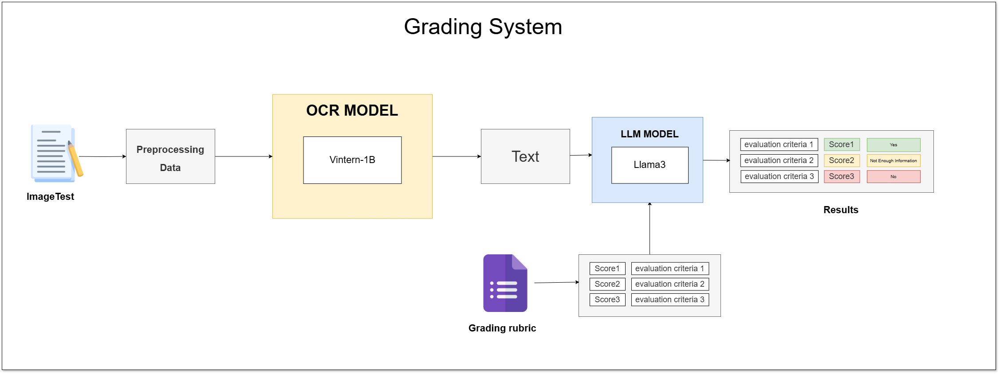

# Ứng dụng OCR và LLM trong Hệ Thống Chấm Thi Tự Động

## Mô tả dự án
Dự án này xây dựng hệ thống chấm thi tự động cho bài thi tự luận viết tay bằng cách kết hợp công nghệ nhận dạng ký tự quang học (OCR) và mô hình ngôn ngữ lớn (LLM). Hệ thống tự động trích xuất nội dung từ ảnh bài làm, sau đó sử dụng LLM để đánh giá và trả về kết quả chấm điểm.

## Giới thiệu về dữ liệu
- **Dữ liệu fine-tune OCR:** Sử dụng tập Viet-Handwriting-Flash2 với khoảng 100.000 dòng dữ liệu viết tay tiếng Việt, phát triển từ các bộ Cinnamon AI Challenge - Handwriting Address và UIT-HWDB. 
- **Dữ liệu chấm bài thi:** Sử dụng tập dữ liệu thực tế gồm 139 bài thi đạo đức nghề nghiệp của sinh viên Đại học Công Nghiệp TP.HCM, được scan PDF, kèm theo label tiêu chí chấm điểm và câu trả lời tương ứng cho từng tiêu chí.

## Quy trình hoạt động


1. **OCR**: Sử dụng mô hình nhận dạng chữ viết tay để chuyển ảnh bài làm thành văn bản.
2. **LLM**: Đưa văn bản vào mô hình ngôn ngữ lớn để trả lời các câu hỏi chấm điểm (YES/NO) theo tiêu chí cho trước.
3. **Kết quả**: Lưu kết quả chấm điểm vào file `result.csv`.

## Yêu cầu môi trường
- Hệ điều hành: Linux (khuyến nghị Ubuntu) hoặc sử dụng nền tảng Kaggle Notebook
- Bắt buộc: Máy có GPU hỗ trợ CUDA (NVIDIA GPU), đã cài đặt driver và CUDA Toolkit
- Python >= 3.9
- Khuyến khích: Đẩy code và dữ liệu lên Kaggle, sử dụng GPU miễn phí của Kaggle để chạy notebook nhanh và ổn định hơn Windows

## Cài đặt
1. Tải mã nguồn về bằng lệnh git:
   ```bash
   git clone https://github.com/taitruong256/AutoGrade-OCR-and-LLM-based-Exam-Scoring-System.git
   cd automatic-grading-ocr-llm
   ```
2. Tải dữ liệu đã tiền xử lý về thư mục `data` và giải nén (dùng bash):
   ```bash
   mkdir -p data
   curl -L -o data/test-data.zip \
     https://www.kaggle.com/api/v1/datasets/download/taitruong256/test-data
   unzip -o data/test-data.zip -d data
   ```
3. Tải mô hình Vintern1B-v2 về thư mục `models` và giải nén (dùng bash):
   ```bash
   mkdir -p models
   curl -L -o models/vintern1b_model.tar.gz \
     https://www.kaggle.com/api/v1/models/phulamquang/vintern_1b_v3_finetune_lora_viet_handwriting/pyTorch/default/1/download
   tar -xzf models/vintern1b_model.tar.gz -C models
   ```
4. Tải mô hình Llama1B-v2 về thư mục `models` và giải nén (dùng bash):
   ```bash
   mkdir -p models
   curl -L -o models/llama3b_model.tar.gz \
     https://www.kaggle.com/api/v1/models/metaresearch/llama-3.2/transformers/3b-instruct/1/download
   tar -xzf models/llama3b_model.tar.gz -C models
   ```
5. Chạy notebook `code/Demo Automatic Grading.ipynb` để thực hiện các bước:
   - Trích xuất văn bản từ ảnh bài làm bằng OCR
   - Đưa văn bản vào LLM để chấm điểm tự động
   - Xuất kết quả ra file CSV

> **Khuyến nghị:** Để tránh lỗi môi trường/phụ thuộc, hãy upload toàn bộ code, dữ liệu và mô hình lên Kaggle, sau đó chạy trực tiếp trên Kaggle Notebook với GPU.

## Chi tiết 
- [Code training Fine-tuned Vintern1B-v2 cho OCR](https://drive.google.com/drive/folders/1KDiZ2Y4zbx2Td5QnFPDn5nD_Vrw55Uv5?usp=drive_link) 
- [Code inference Llama-3B](https://www.kaggle.com/code/taitruong256/inference-llama-3b)
- [Code demo](https://www.kaggle.com/code/phulamquang/demo-automatic-grading)

## Thông tin liên hệ
- Tác giả: Trương Đức Tài, Lâm Quang Phú, Đào Xuân Hoàng Tuấn 
- Slide báo cáo: Xem thư mục `slide/`
